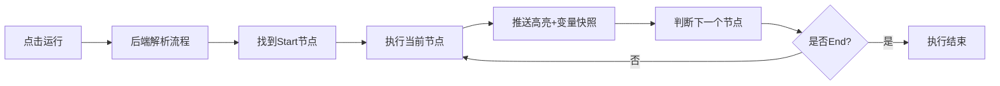

## 1. 产品概述

可视化流程图编辑器+执行引擎是一个面向开发者和业务人员的低代码流程编排平台。用户通过拖拽方式构建业务流程，定义节点逻辑和流转规则，系统自动执行并实时反馈运行状态。

- 核心价值：将复杂业务逻辑转化为可视化流程图，降低编程门槛，提升流程可维护性
- 目标用户：开发者、业务分析师、运维人员
- 市场定位：轻量级工作流引擎，支持条件分支、循环、延时等控制结构

## 2. 核心功能

### 2.1 用户角色

| 角色 | 注册方式 | 核心权限 |
|------|----------|----------|
| 普通用户 | 无需注册（本地使用） | 编辑流程、执行流程、查看运行状态、保存/加载流程 |

### 2.2 功能模块

1. **流程编辑器**：节点拖拽、边连接、参数编辑
2. **执行引擎**：流程解析、节点执行、条件判断、循环控制
3. **运行时监控**：实时高亮、变量快照、Trace日志
4. **执行控制**：启动/暂停/恢复/单步/停止
5. **流程管理**：保存/加载流程定义JSON

### 2.3 页面详情

| 页面名称 | 模块名称 | 功能描述 |
|-----------|-------------|---------------------|
| 主页面 | 左侧节点面板 | 展示可拖拽的节点类型（Start/End/Task/Condition/Loop/Wait） |
| 主页面 | 中间画布 | react-flow 流程图编辑区域，支持拖拽、连接、双击编辑 |
| 主页面 | 右侧属性面板 | 展示选中节点的参数编辑表单 |
| 主页面 | 顶部工具栏 | 执行控制按钮（运行/暂停/恢复/单步/停止/保存/加载） |
| 主页面 | 底部监控面板 | 变量快照展示、Trace日志列表、当前活跃节点ID |

## 3. 核心流程

### 3.1 流程编辑流程

用户从左侧面板拖拽节点到画布 → 连接节点边 → 双击节点编辑参数 → 保存流程定义

### 3.2 流程执行流程

用户点击运行 → 后端加载流程 → 从Start节点开始遍历 → 执行节点逻辑 → 推送实时状态 → 遇到End节点结束

## 4. 用户界面设计

### 4.1 设计风格

- **主色调**：深色科技风，主色 #3b82f6（蓝色），强调色 #10b981（绿色），警告色 #ef4444（红色）
- **背景**：#0f172a（深蓝灰），卡片背景 #1e293b
- **按钮风格**：圆角 6px，hover 提升阴影，active 状态轻微下压
- **字体**：主字体 Inter，等宽字体 JetBrains Mono（代码编辑）
- **布局风格**：三栏布局，固定左侧面板和右侧属性栏，中间画布自适应
- **图标风格**：lucide-react 线性图标

### 4.2 页面设计概述

| 页面名称 | 模块名称 | UI Elements |
|-----------|-------------|-------------|
| 主页面 | 左侧节点面板 | 垂直排列6种节点卡片，拖拽时半透明，hover时边框高亮 |
| 主页面 | 中间画布 | 网格背景，节点圆角卡片，边贝塞尔曲线，活跃节点脉冲动画 |
| 主页面 | 右侧属性面板 | 表单式布局，代码编辑器使用 monaco 主题，实时验证 |
| 主页面 | 顶部工具栏 | 图标按钮组，分隔线区分功能组，tooltip 提示 |
| 主页面 | 底部监控面板 | 可折叠，变量表格支持编辑，Trace日志支持导出 |

### 4.3 响应性

- 桌面端：三栏布局，左栏 240px，右栏 320px，中间自适应
- 平板：左右栏可折叠为图标模式
- 移动端：优先保证画布区域，面板改为抽屉式

### 4.4 动画效果

- 节点拖拽：ghost 预览，放置时弹性动画
- 活跃节点：蓝色边框脉冲动画，背景呼吸灯效果
- 边流转：虚线流动动画，从上游指向下游
- 面板展开/折叠：平滑过渡 200ms ease-out
