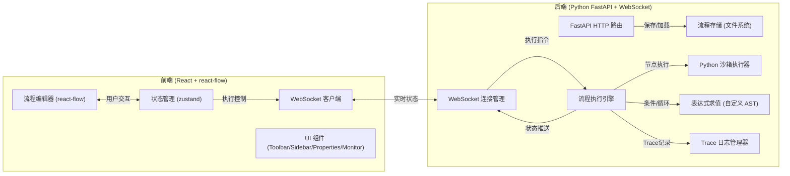
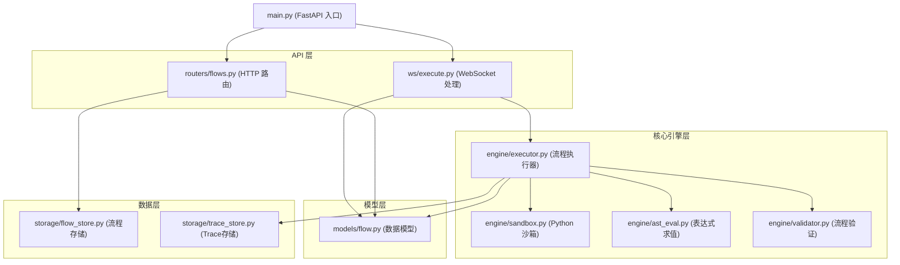

## 1. 架构设计



## 2. 技术描述

### 2.1 前端技术栈
- **框架**: React 18 + TypeScript
- **构建工具**: Vite
- **流程图**: reactflow@11
- **状态管理**: zustand
- **样式**: tailwindcss@3
- **WebSocket**: 原生 WebSocket API
- **代码编辑**: @uiw/react-codemirror
- **图标**: lucide-react

### 2.2 后端技术栈
- **框架**: FastAPI 0.109.x
- **WebSocket**: 原生 FastAPI WebSocket
- **Python 沙箱**: RestrictedPython + 自定义白名单
- **表达式求值**: 自实现 AST 解析器 (基于 ast 模块)
- **数据存储**: JSON 文件存储 (./flows 目录)
- **异步执行**: asyncio 事件循环

## 3. 数据模型

### 3.1 核心数据结构

```typescript
// 节点类型
type NodeType = 'start' | 'end' | 'task' | 'condition' | 'loop' | 'wait';

// 流程节点
interface FlowNode {
  id: string;
  type: NodeType;
  position: { x: number; y: number };
  data: NodeData;
}

// 节点数据
interface NodeData {
  label: string;
  code?: string;        // Task节点: Python代码
  expression?: string;  // Condition/Loop: 表达式
  seconds?: number;     // Wait节点: 延时秒数
  anchorId?: string;    // Loop节点: 循环锚点ID
}

// 流程边
interface FlowEdge {
  id: string;
  source: string;
  target: string;
  sourceHandle?: 'true' | 'false' | 'loop'; // Condition有true/false分支
}

// 流程定义
interface FlowDefinition {
  id: string;
  name: string;
  nodes: FlowNode[];
  edges: FlowEdge[];
  createdAt: number;
  updatedAt: number;
}

// 执行状态
interface ExecutionState {
  flowId: string;
  status: 'idle' | 'running' | 'paused' | 'stopped' | 'completed' | 'error';
  currentNodeId: string | null;
  variables: Record<string, any>;
  trace: TraceLog[];
  loopCounts: Record<string, number>;
}

// Trace日志
interface TraceLog {
  timestamp: number;
  nodeId: string;
  nodeType: NodeType;
  action: 'enter' | 'exit' | 'error';
  variables: Record<string, any>;
  message?: string;
}
```

### 3.2 WebSocket 消息协议

```typescript
// 客户端 -> 服务端
type ClientMessage =
  | { type: 'execute'; flow: FlowDefinition }
  | { type: 'pause' }
  | { type: 'resume' }
  | { type: 'step' }
  | { type: 'stop' }
  | { type: 'setVariable'; name: string; value: any };

// 服务端 -> 客户端
type ServerMessage =
  | { type: 'nodeEnter'; nodeId: string; variables: Record<string, any> }
  | { type: 'nodeExit'; nodeId: string; variables: Record<string, any> }
  | { type: 'nodeError'; nodeId: string; error: string; variables: Record<string, any> }
  | { type: 'status'; status: ExecutionState['status']; variables: Record<string, any> }
  | { type: 'trace'; log: TraceLog }
  | { type: 'completed'; variables: Record<string, any>; trace: TraceLog[] }
  | { type: 'error'; message: string };
```

## 4. API 定义

### 4.1 HTTP 接口

| 方法 | 路径 | 描述 | 请求 | 响应 |
|------|------|------|------|------|
| GET | /api/flows | 获取所有流程列表 | - | FlowDefinition[] |
| GET | /api/flows/:id | 获取单个流程 | - | FlowDefinition |
| POST | /api/flows | 创建流程 | FlowDefinition | FlowDefinition |
| PUT | /api/flows/:id | 更新流程 | FlowDefinition | FlowDefinition |
| DELETE | /api/flows/:id | 删除流程 | - | { success: boolean } |
| GET | /api/flows/:id/export | 导出流程 | - | JSON 文件 |

### 4.2 WebSocket 端点

| 路径 | 描述 |
|------|------|
| /ws/execute | 流程执行实时通信通道 |

## 5. 后端模块架构



## 6. 核心算法设计

### 6.1 自定义 AST 表达式求值器

```python
# 仅支持的操作:
# 二元运算: +, -, *, /, %, ==, !=, <, <=, >, >=, and, or
# 一元运算: not, -
# 变量访问: ctx['name'] 或 ctx.name
# 常量: 数字, 字符串, True, False, None
# 禁止: 函数调用, import, 类定义, 循环等

# 实现方式: 使用 ast 模块解析用户输入, 递归遍历 AST 节点,
# 只允许白名单内的节点类型, 变量只能从 ctx 字典读取
```

### 6.2 Python 沙箱执行器

```python
# 使用 RestrictedPython 实现安全沙箱
# 白名单:
# - 可访问: ctx 字典, math 模块, datetime 模块
# - 不可访问: __import__, 文件操作, 网络操作, 系统调用
# - 执行时间限制: 5秒超时
# - 内存限制: 100MB
```

### 6.3 流程遍历算法

```
1. 验证流程结构:
   - 有且仅有一个 Start 节点
   - 有且仅有一个 End 节点
   - 所有非 Start 节点至少有一条入边
   - 所有非 End 节点至少有一条出边
   - 环只能由 Loop 节点构成 (拓扑排序检测)

2. 执行算法:
   current_node = find_start_node()
   while current_node is not End:
       enter_node(current_node)  # 推送高亮 + 记录Trace
       execute_node(current_node)
       exit_node(current_node)
       
       if paused: 等待恢复信号
       if stopped: break
       
       if current_node.type == 'condition':
           result = evaluate_expression(expression)
           next_node = get_neighbor(result ? 'true' : 'false')
       elif current_node.type == 'loop':
           result = evaluate_expression(expression)
           if result:
               increment_loop_count(node_id)
               if loop_count > 10000: raise InifiniteLoopError
               next_node = anchor_node
           else:
               next_node = next_normal_node
       else:
           next_node = get_single_neighbor()
       
       current_node = next_node
```

## 7. 目录结构

### 7.1 后端目录

```
backend/
├── main.py                    # FastAPI 入口
├── requirements.txt           # Python 依赖
├── models/
│   └── flow.py               # 数据模型 (Pydantic)
├── routers/
│   └── flows.py              # HTTP 路由
├── ws/
│   └── execute.py            # WebSocket 处理器
├── engine/
│   ├── __init__.py
│   ├── executor.py           # 流程执行引擎
│   ├── sandbox.py            # Python 沙箱执行器
│   ├── ast_eval.py           # 自定义 AST 表达式求值
│   └── validator.py          # 流程结构验证
└── storage/
    ├── flow_store.py         # 流程文件存储
    └── trace_store.py        # Trace 日志存储
```

### 7.2 前端目录

```
frontend/
├── src/
│   ├── main.tsx              # React 入口
│   ├── App.tsx               # 主应用组件
│   ├── store/
│   │   └── useFlowStore.ts   # zustand 状态管理
│   ├── components/
│   │   ├── FlowEditor.tsx    # react-flow 编辑器
│   │   ├── Sidebar.tsx       # 左侧节点面板
│   │   ├── Toolbar.tsx       # 顶部工具栏
│   │   ├── Properties.tsx    # 右侧属性面板
│   │   ├── Monitor.tsx       # 底部监控面板
│   │   └── nodes/            # 自定义节点组件
│   │       ├── StartNode.tsx
│   │       ├── EndNode.tsx
│   │       ├── TaskNode.tsx
│   │       ├── ConditionNode.tsx
│   │       ├── LoopNode.tsx
│   │       └── WaitNode.tsx
│   ├── hooks/
│   │   └── useWebSocket.ts   # WebSocket 连接 Hook
│   ├── types/
│   │   └── flow.ts           # TypeScript 类型定义
│   └── utils/
│       └── flowUtils.ts      # 工具函数
├── package.json
├── vite.config.ts
└── tailwind.config.js
```

## 8. 安全设计

1. **代码沙箱**: 使用 RestrictedPython 限制 Python 代码执行
2. **表达式白名单**: 仅允许基本运算和 ctx 变量访问
3. **超时控制**: 单个节点执行超时 5 秒强制终止
4. **循环检测**: Loop 节点访问超过 10000 次自动中止
5. **变量隔离**: 每个流程执行实例有独立的变量上下文
6. **文件存储**: 流程文件仅存储在指定目录，禁止路径遍历
